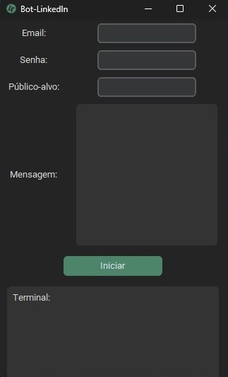

# LinkedIn Connection Bot - Python Selenium

## Descrição  / Description
Este é um bot desenvolvido em Python usando Selenium para automatizar o processo de conexões no LinkedIn. Ele é projetado para ajudar a expandir sua rede de contatos de maneira eficiente e sem esforço manual.

## Funcionalidades Principais / Key Features
- Login Automatizado: O bot faz login na sua conta do LinkedIn automaticamente.
- Envio de Convites: Envia convites de conexão para perfis conforme critérios definidos.
- Personalização: Pode ser configurado para incluir uma mensagem personalizada junto com o convite de conexão.

## Bibliotecas usadas / Used Libraries
- Selenium
- Customtkinter
- Threading
- Time

## Observações / Notes
- Execute o arquivo index.py para iniciar a aplicação no terminal.
- Para o executável, foram feitas algumas mudanças nas importações.
- O LinkedIn suporta no máximo 200 caracteres na mensagem personalizada; se ultrapassar esse limite, o código não funcionará.
- O protótipo desta aplicação foi feito para buscar apenas a primeira página do público-alvo selecionado.

## Instruções de uso / Usage Instructions
- Execute o arquivo .exe.
- Faça login na sua conta do LinkedIn.
- Digite o público-alvo das suas conexões.
- Digite uma mensagem com no máximo 200 caracteres.
- Clique no botão iniciar e aguarde o processo.

[Baixar a última versão / Download the latest version ](https://github.com/Synergy4tech/Bot-LinkedIn/releases/tag/bot)

